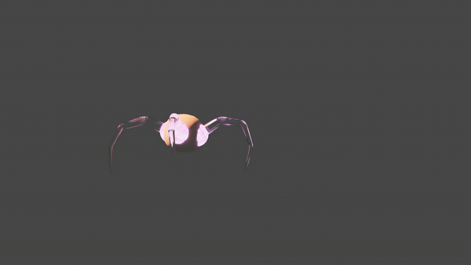

# hopper

Meet hopper, the anthropomorphic sphere

Give him a try! [hopper](https://hopper-hazel.vercel.app/)
  
### index
[narrative](#-narrative)
.
[gameplay](#-gameplay)
.
[showcase](#-showcase)

## narrative
TODO

## gameplay

TODO

## 🌟 showcase

 physics 

  

 bosses 

 The first boss design! Fully modeled and rigged. Working on the mechanics and shaders to break its legs in the boss fight. 

  

## stack

1. **React** [^2]

2. **Electron** [^3]

3. **WebGL** [^4]

4. **Rapier** [^5]

5. **Vercel** [^6]

### footnotes

[^1]: placeholder link

[^2]: placeholder link

[^3]: placeholder link

[^4]: placeholder link

[^5]: placeholder link

[^6]: placeholder link
